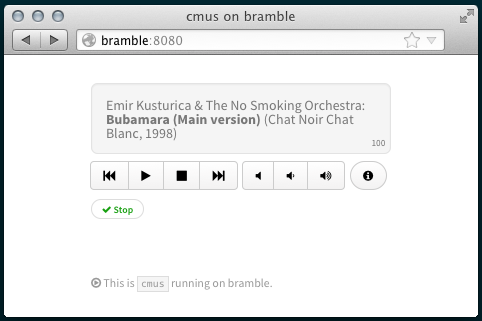

# cmus-remote web app

This is a web app to control a server instance of
[`cmus`](https://cmus.github.io/), a powerful music player, remotely. So far it
only supports basic player and volume controls, not adding items to the
playlist. 

## Dependencies

- Python (tested with 2.7)
- [`bottle`](http://bottlepy.org)
- [`sh`](http://amoffat.github.com/sh/)

The web app also makes use of [Zepto](http://zeptojs.com/),
[Kube](http://imperavi.com/kube), and [Font
Awesome](http://fortawesome.github.com/Font-Awesome/). These are all included.
Thanks to the creators for making them available under permissive licenses. 

## Instructions

The web app can run on the same host as the `cmus` instance you want to control
or a different one, but both hosts will have to have `cmus` installed.

### On the cmus host

- Run an instance of `cmus` using the `--listen` option.

        $ cmus --listen <host>

- Set a password in `cmus` using `:set passwd=<passwd>`.

### On the web app host

- Install `bottle` and `sh` and fetch cmus_app.

        $ pip install bottle sh
        $ git clone git://github.com/jboynyc/cmus_app
        $ cd cmus_app

- Edit the configuration file. (Optional.)
- Run the app with a configuration file or command-line options:

        $ python app.py -f <config_file>
        $ python app.py -c raspberry -w PaSsWd -a localhost -p 8080

### Anywhere on your network

- Open your browser and navigate to `http://<host>:<port>`.

Enjoy!

### Prior Art and Alternatives

Take a look on the [cmus wiki](https://github.com/cmus/cmus/wiki/remote-control).
